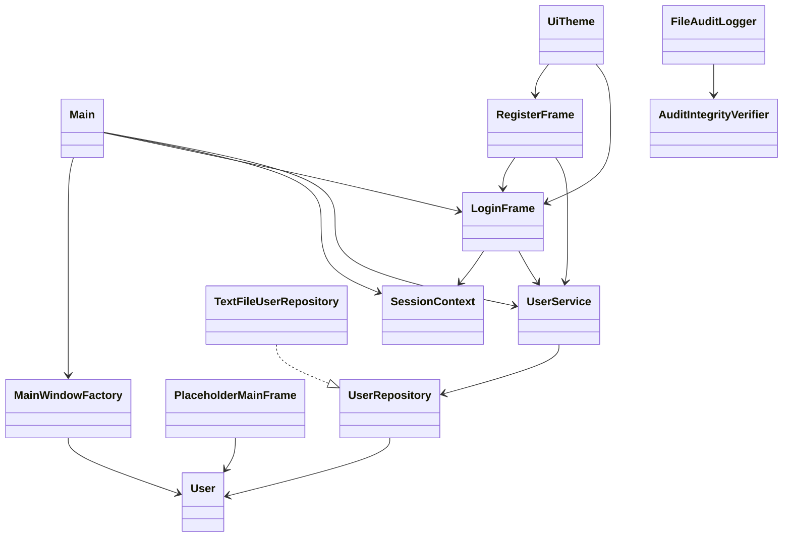

# Diagrama UML básico

```mermaid
classDiagram
    class Main
    class UserService
    class UserRepository
    class TextFileUserRepository
    class User
    class SessionContext
    class FileAuditLogger
    class AuditIntegrityVerifier
    class LoginFrame
    class RegisterFrame
    class PlaceholderMainFrame
    class MainWindowFactory
    class UiTheme

    Main --> UserService
    Main --> SessionContext
    Main --> LoginFrame
    Main --> MainWindowFactory
    UserService --> UserRepository
    UserRepository --> User
    TextFileUserRepository ..|> UserRepository
    LoginFrame --> UserService
    LoginFrame --> SessionContext
    RegisterFrame --> UserService
    RegisterFrame --> LoginFrame
    PlaceholderMainFrame --> User
    MainWindowFactory --> User
    UiTheme --> LoginFrame
    UiTheme --> RegisterFrame
    FileAuditLogger --> AuditIntegrityVerifier
```
